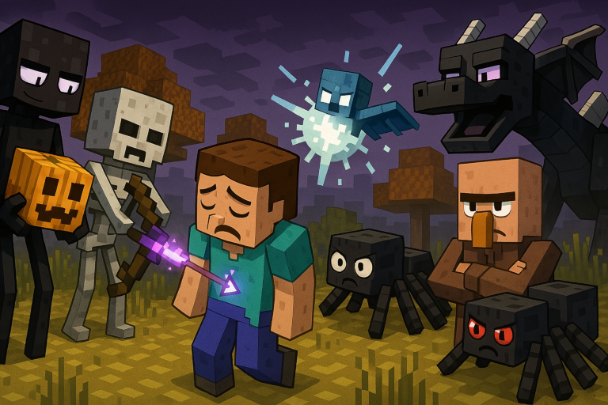

## Compatibility

Tested on Spigot-1.20.5, 1.21.1, 1.21.5, 1.21.6.

## Introduction

Make survival harder keeping the spirit of vanilla survival.

The most essential aspects are configurable.

## Features

* Synergies perfectly with [TakeAim](https://github.com/uprial/takeaim) and [CustomCreatures](https://github.com/uprial/customcreatures) plugins
* Nasty Enderman: a percentage of Endermans attack players immediately on spawn and ignore carved pumpkins
* Nasty Archer: arrow archers have a chance to add both positive and negative effects to their arrows
* Angry Shooter: shooting mobs target the closest visible player immediately when spawned, and then occasionally
* Nasty Ender Dragon: the Ender Dragon has increased regen, explosion resistance and damage limit, periodically resurrects healing crystals, and targets fireballs and random endermans to aggressive players
* Explosive Shooter: a percentage of shooters equip explosive projectiles 
* Greedy Villager: villagers don't sell imbalanced clothes with environmental protection and overprice imbalanced mending
* Limit Elytras: players flying too high are frozen
* Hydra Spiders: a percentage of Spiders multiply on death into smaller and faster
* Radical Phantoms: a percentage of Phantoms explode when give damage, take damage, or die

## Commands

`masochisticsurvival reload` - reload config from disk

## Permissions

* Access to 'reload' command:
`masochisticsurvival.reload` (default: op)

## Configuration
[Default configuration file](src/main/resources/config.yml)

If you see in server logs something like
`[Server thread/ERROR]: [MasochisticSurvival] [ERROR] Empty try angering interval in s of 'angry-shooter'`
it could mean you updated the plugin version, and a new config parameter is now required.
Please, try first to backup your old config file and remove it, so the plugin regenerates it.

## Author
I will be happy to add some features or fix bugs. My mail: uprial@gmail.com.

## Useful links
* [Project on GitHub](https://github.com/uprial/masochisticsurvival)
* [Project on Bukkit Dev](https://legacy.curseforge.com/minecraft/bukkit-plugins/masochisticsurvival)
* [Project on Spigot](https://www.spigotmc.org/resources/masochisticsurvival.124943/)

## Related projects
* CustomBazookas: [Bukkit Dev](https://legacy.curseforge.com/minecraft/bukkit-plugins/custombazookas/) [GitHub](https://github.com/uprial/custombazookas), [Spigot](https://www.spigotmc.org/resources/custombazookas.124997/)
* CustomCreatures: [Bukkit Dev](http://dev.bukkit.org/bukkit-plugins/customcreatures/), [GitHub](https://github.com/uprial/customcreatures), [Spigot](https://www.spigotmc.org/resources/customcreatures.68711/)
* CustomNukes: [Bukkit Dev](http://dev.bukkit.org/bukkit-plugins/customnukes/), [GitHub](https://github.com/uprial/customnukes), [Spigot](https://www.spigotmc.org/resources/customnukes.68710/)
* CustomRecipes: [Bukkit Dev](https://dev.bukkit.org/projects/custom-recipes), [GitHub](https://github.com/uprial/customrecipes/), [Spigot](https://www.spigotmc.org/resources/customrecipes.89435/)
* CustomVillage: [Bukkit Dev](http://dev.bukkit.org/bukkit-plugins/customvillage/), [GitHub](https://github.com/uprial/customvillage/), [Spigot](https://www.spigotmc.org/resources/customvillage.69170/)
* TakeAim: [Bukkit Dev](https://dev.bukkit.org/projects/takeaim), [GitHub](https://github.com/uprial/takeaim), [Spigot](https://www.spigotmc.org/resources/takeaim.68713/)
